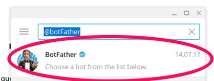
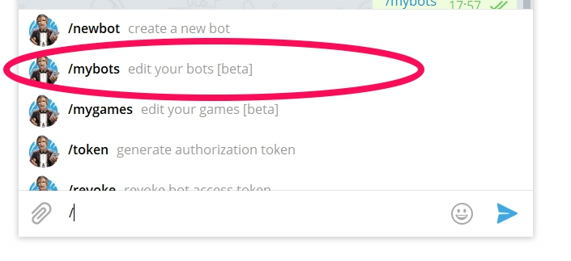
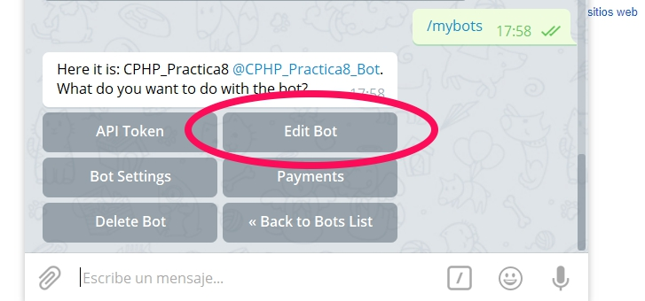
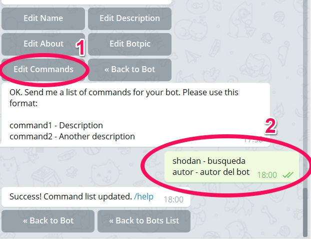

# Shodan Bot for Telegram

## How to set up the bot.

The first thing we have to do is look for the **@botFather** in Telegram



Write the command */newbot*


Fill in the information requested by us **@botFather** and find the **TOKEN** for our BOT.

## Add Commands to the Bot

> 1. Write the command **/mybots**.



> 2. Edit the Bot by clicking on the **Edit Bot** button



> 3. Click the **Edit Commands** button and write the list of commands with this format:

```sh
shodan - search
author - author of the bot
```



## Getting the Shodan API Key

Go to https://www.shodan.io/, log in and push the **SHOW API KEY** button at the top right.

## Installation

**Linux** (Ubuntu - Debian):

```sh
pip3 install pyTelegramBotAPI
```

```sh
pip3 install shodan
```

```sh
pip3 install sqlite3
```


**Linux** (Arch Linux - Antergos):

```sh
pip install pyTelegramBotAPI
```

```sh
pip install shodan
```

```sh
pip install sqlite3
```

## External APIs of the bot

Put your Shodan API Key and your Telegram API Key in these files:
*shodan-key.txt*
*telegram-key.txt*

## Running the Bot

Run the file **start.py**

**Linux** (Ubuntu - Debian):

```sh
python3 start.py
```

**Linux** (Arch Linux - Antergos):

```sh
python start.py
```
## Database

If you wish to visualize the database the bot uses, open the database in this program: http://sqlitebrowser.org/

## Video of the bot in action!

[](https://www.youtube.com/watch?v=Zpngydf6iwQ)
